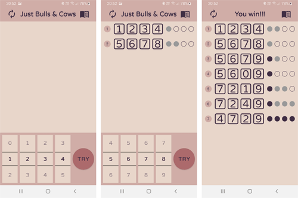
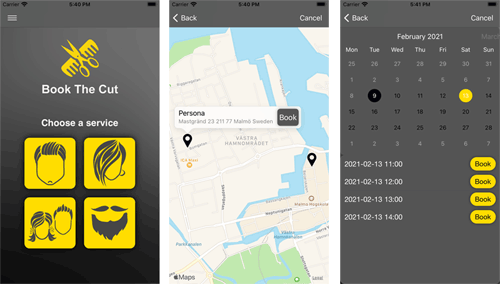
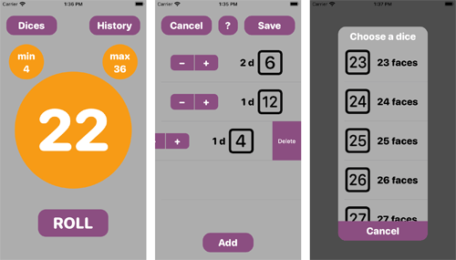

## Portfolio

---
Mobile app developer and computer engineer with diverse and extensive exposure to software
and hardware development lifecycle, as well as software-hardware integration. Experienced in
telecom, high-performance computing, and security systems. Worked in various multicultural
teams, effectively contributing to collective delivery. A fast and eager learner, capable to work
independently on stand-alone tasks. Passionate about my work and new technologies.

### Android projects 
---
<h4>&nbsp;Darts Trainig Calculator</h4>
[GitHub](https://github.com/VitaliyBeletskiy/DartsTrainingCalculator_Android)  
[Google Play](https://play.google.com/store/apps/details?id=com.beletskiy.dartstrainingcalculator)  

The app counts scores during Darts training session.  
**Tags:** *Kotlin, Hilt, Navigation, Safe Args, (Shared) ViewModel, LiveData, Two-way Data Binding (Binding Adapters), Room, Coroutines, Preference*  
<!--  -->

---
<h4>&nbsp;Just Bulls & Cows</h4>
[GitHub](https://github.com/VitaliyBeletskiy/BullsAndCows_kotlin)  
[Google Play](https://play.google.com/store/apps/details?id=com.beletskiy.bullscows)  

Just Bulls & Cows is a simple logical game. The goal of the game is to guess the the secret number with a minimal number of attempts.  
**Tags:** *Kotlin, Navigation, Safe Args, ViewModel, LiveData, Two-way Data Binding (Binding Adapters), Coroutines*  
<!--  -->

---

### iOS projects 
---
<h4>&nbsp;BookTheCut</h4>
[GitHub](https://github.com/VitaliyBeletskiy/BookTheCut_Swift)  

BookTheCut is a client-side booking application which helps to book a visit to a beauty salon or a barbershop.  

---
<h4>&nbsp;Just Bulls & Cows</h4>
[GitHub](https://github.com/VitaliyBeletskiy/BullsAndCows_SwiftUI)  
[AppStore](https://apps.apple.com/us/app/just-bulls-cows/id1546216624)  

Just Bulls & Cows is a simple logical game. The goal of the game is to guess the the secret number with a minimal number of attempts.  

---
<h4>&nbsp;AnyDice</h4>
[GitHub](https://github.com/VitaliyBeletskiy/AnyDice)  
[AppStore](https://apps.apple.com/us/app/anydice/id1540270825)  

AnyDice is a simple and lightweight app that allows to roll any number of dices with up to 50 faces and keep track of the rolls results.  

---
<h4>&nbsp;Worm</h4>
[GitHub](https://github.com/VitaliyBeletskiy/Worm)  

---

Page template forked from <a href="https://github.com/evanca/quick-portfolio">evanca</a>

<!-- Remove above link if you don't want to attibute -->
